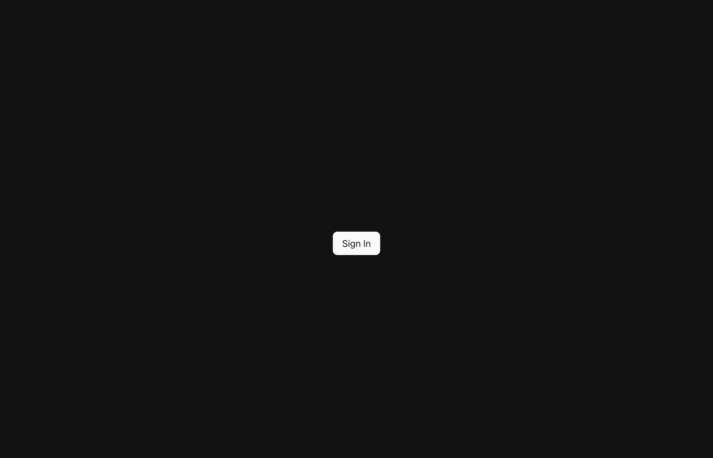
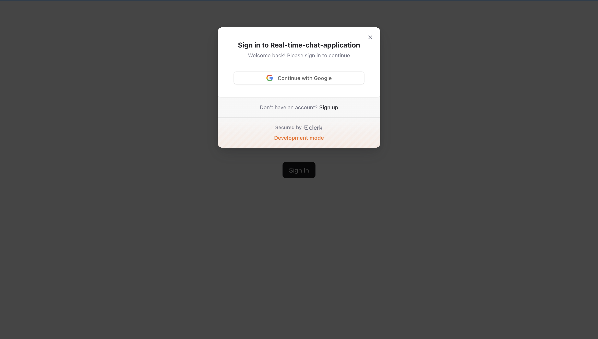
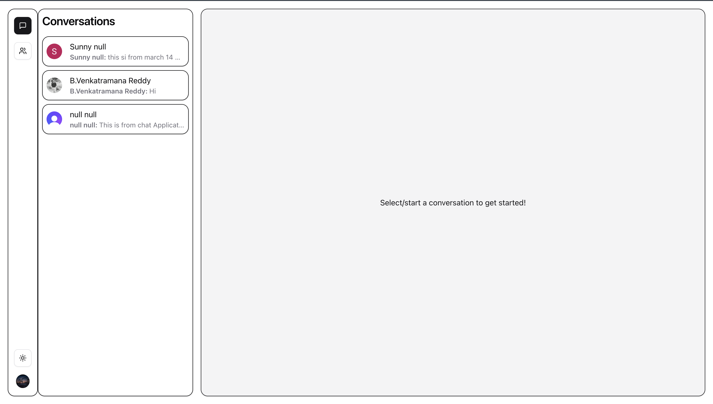
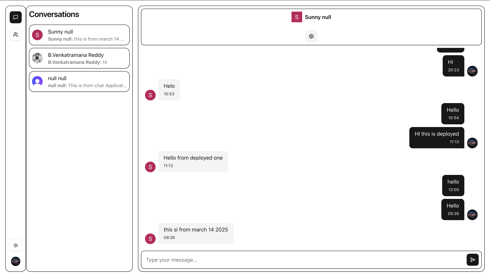
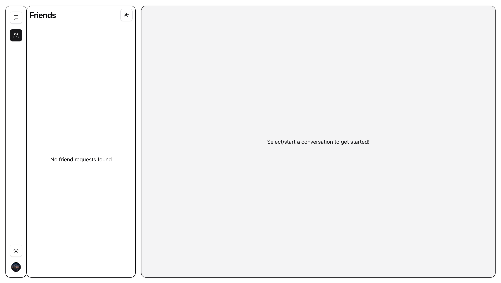

**Real-Time Chat Messenger** 💬🚀
=================================

A fully functional, real-time messaging application built with modern web technologies. Users can sign in, invite others, and chat instantly---all in real time!

**Live Demo**
-------------

Try it out here: **[Live Chat App](https://realtime-chat-application-xxew.onrender.com/)**

**Tech Stack**
--------------

-   **Next.js** -- Full-stack framework for optimized performance
-   **Tailwind CSS** -- Clean, responsive, and mobile-friendly UI
-   **Convex** -- Real-time backend for instant messaging
-   **Clerk** -- Secure authentication & user management
-   **Zod** -- Ensures strict data validation & type safety
-   **ShadCN** -- Modern pre-styled UI components

**Features**
------------

-   Google & Email Authentication (via Clerk)
-   User Invitations & Friend System
-   Real-Time Messaging with instant updates (via Convex)
-   Beautiful, Responsive UI (using Tailwind CSS + ShadCN)
-   Secure & Scalable (Next.js with Clerk authentication)


**Getting Started**
-------------------

### 1️⃣ Clone the Repository

Run the following command to clone the project and install dependencies:

bash


`git clone https://github.com/PARANDHAMAREDDYBOMMAKA/realtime-chat-application
cd realtime-chat-messenger
npm install`

### 2️⃣ Set Up Environment Variables

Create a **.env.local** file in the project root and add the following variables:

``` sh 
# Deployment used by `npx convex dev`

CONVEX_DEPLOYMENT=your-convex-deployment

NEXT_PUBLIC_CONVEX_URL=your-convex-url

# Clerk keys

NEXT_PUBLIC_CLERK_PUBLISHABLE_KEY=your-clerk-publishable-key

CLERK_SECRET_KEY=your-clerk-secret-key

CLERK_WEBHOOK_SECRET=your-clerk-webhook-secret
```

⚠️ **Important:**

-   Do **NOT** expose sensitive keys publicly. Keep them private in `.env.local`.
-   Ensure `.env.local` is included in your `.gitignore` file to prevent accidental leaks.

### 3️⃣ Run the Development Server

Run the following command to start the development server:


`npm run dev`

The app will be available at **<http://localhost:3000>**.

**Deployment**
--------------

This app is deployed on **Render**. You can deploy it to your own hosting provider using:


`vercel `

or


`npm run build && npm run start`

**Future Improvements**
-----------------------

-   Group Chats & Multi-User Conversations
-   Message Read Receipts
-   Typing Indicators
-   Custom Avatars & User Profiles

**Screenshots**
----------------


*Login Screen*


*Signing Modal*


*Conversations Overview*


*Chat Page*


*Friend Request Screen*

**Feedback & Contributions**
----------------------------

Feel free to try out the app, share your feedback, or contribute to make it even better!


🚀 Happy Coding! 🚀
